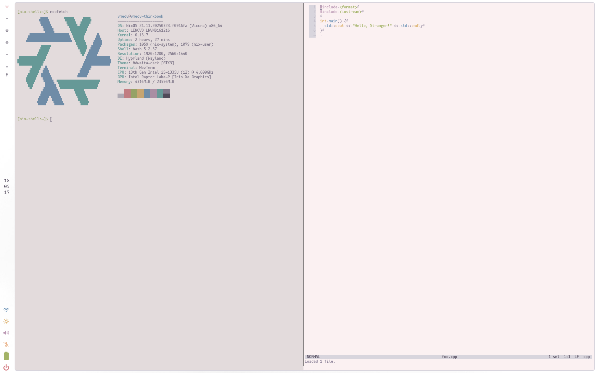
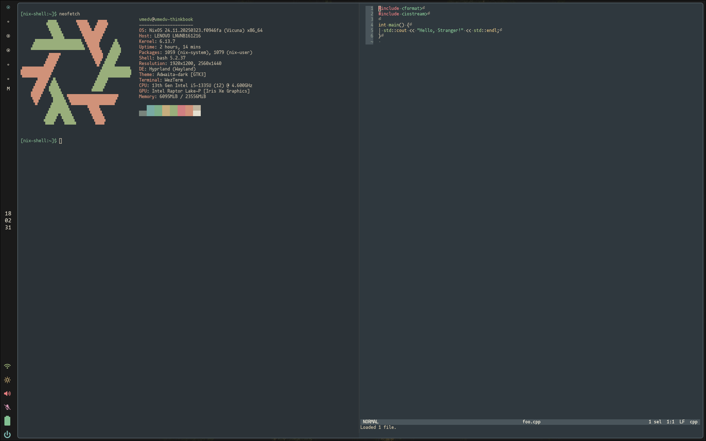

# my home manager config

main setup: hyprland, eww, zen, helix

## screenshots

### light (base16-cupcake based)

### dark (base16-everforest based)

## roadmap

now i have some ideas, but lack of time to implement:

- [ ] extend theme module & friend it with nix-colors more flawlessly;
- [ ] change theme toggle switching (now it takes too much effort: `home manager switch` + relogin to session, manual switch in telegram and zen);
- [ ] spotify don't respect theme (possibly will be fixed via spicetify);
- [ ] change cursor with theme;
- [ ] rework eww controls (sound, brightness, etc).

